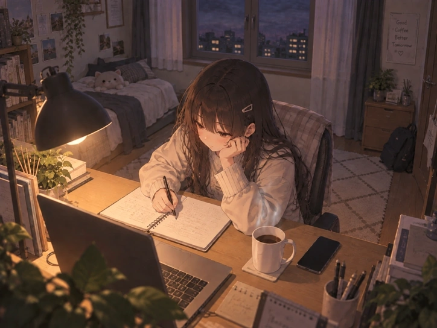

# cinemagraph

Procedural cinemagraph experiments: a still image stays as is and only masked
regions are animated with seamless, periodic effects.



## Usage

```sh
uv sync
uv run python -m cinemagraph.render  # writes output/night_study.mp4 and .webp
```

Options: `--period` (loop length in seconds, default 6), `--fps` (default 30).

## Effects

- `steam`: steam rising from the coffee cup
- `city_lights`: lit windows outside dim and recover, a TV-lit room, a blinking rooftop beacon
- `clouds`: clouds in the night sky drift slowly to the right
- `lamp`: the desk lamp's light breathes gently

## Review tools

Scripts in `review/` export frames and measure an output (visibility, loop
seam, frame-to-frame evenness):

```sh
uv run python review/loop_metrics.py output/night_study.mp4
PYTHONPATH=review uv run python review/smoothness.py output/night_study.mp4
PYTHONPATH=review uv run python review/sky_metrics.py output/night_study.mp4
```

The source image `assets/source/night_study.png` is AI-generated.
